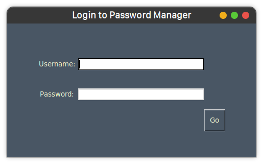
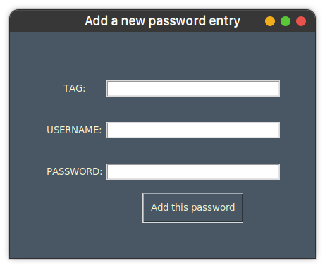
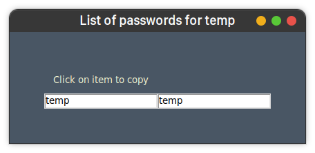
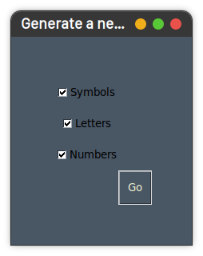

    
    
    
    

# 🐍 Python Password Manager 🔐

## An extensive password manager built using Python ✨

This repo will consist of various implementations for a password manager, all of which will be implemented only using
python.
[For android app (planned, not yet implemented) we will be using java]

## Current implementations available:

1. [Tkinter-based](pass-manager-tkinter) GUI Application. Documentation [here.](#tkinter-based-gui)

## Planned implementations:

1. Web App using Django.
2. Android App.

## Documentations:

### Tkinter-based-gui:

Pre-requisites:

* Python 3.
* Requirements [here.](pass-manager-tkinter/requirements.txt)

How to run:

* Simply run command `python3 launcher.py`.
* Inside your python env.

Screenshots:

    
    
    
    
    

To-Do:

* Add file encryption.
* Add cloud-based backups.