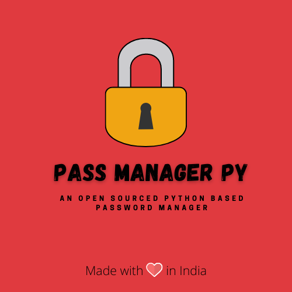

    
    
    
    
    

## 🐍 Python Password Manager 🔐

### An extensive password manager built using Python ✨

Multiple implementations for a password manager, all based on python. Choose an implementation based on what features
you'd like!
 
More implementations on the way!

### Current implementations available:

|                  Title                    |                                                              Description                                                                |            Storage            |            Documentations                |
|:---------------------------------------:	|:-------------------------------------------------------------------------------------------------------------------------------------:	|:----------------------------:	|:------------------------------------:	|
| Desktop GUI Application:Encrypted Files    |                   A Tkinter based desktop GUI application that uses locally stored encrypted files for data storage.                    | Local-only, Encrypted files.    | [Here!](docs/Tk_encrypted_README.md)    |
|    Terminal GUI Application: Mongodb        | A Terminal based GUI application, that is fast, lightweight and simple. Gets the job done quickly. It uses Mongo Db for data storage.    |    Local/Hosted, Mongo db.    |   [Here!](docs/Tui_mongo_README.md)    |

To request more features/implementations, please create an issue or add an idea in the discussions on the repo. :)
## Contributors ✨

Thanks goes to these wonderful people ([emoji key](https://allcontributors.org/docs/en/emoji-key)):

<!-- ALL-CONTRIBUTORS-LIST:START - Do not remove or modify this section -->
<!-- prettier-ignore-start -->
<!-- markdownlint-disable -->

<table>
  <tr>
    <td align="center"><a href="https://github.com/schmelto"> <b>schmelto</b></a> <a href="https://github.com/SamDev98/password-manager-py/commits?author=schmelto" title="Documentation">📖</a></td>
    <td align="center"><a href="https://github.com/Vyvy-vi"> <b>Vyom Jain</b></a> <a href="#ideas-Vyvy-vi" title="Ideas, Planning, & Feedback">🤔</a></td>
    <td align="center"><a href="https://jaid.tech/"> <b>Jai Kumar Dewani</b></a> <a href="#ideas-jai-dewani" title="Ideas, Planning, & Feedback">🤔</a></td>
    <td align="center"><a href="http://www.nhcarrigan.com"> <b>Nicholas Carrigan (he/him)</b></a> <a href="https://github.com/SamDev98/password-manager-py/commits?author=nhcarrigan" title="Documentation">📖</a></td>
  </tr>
</table>

<!-- markdownlint-restore -->
<!-- prettier-ignore-end -->
<!-- ALL-CONTRIBUTORS-LIST:END -->

This project follows the [all-contributors](https://github.com/all-contributors/all-contributors) specification.
Contributions of any kind welcome and appreciated!