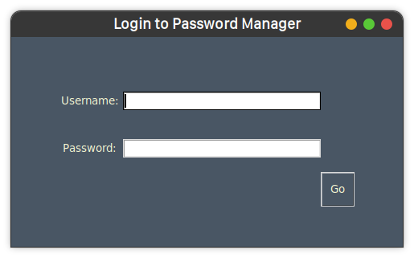
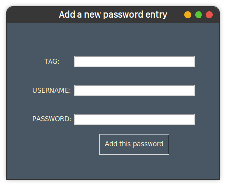
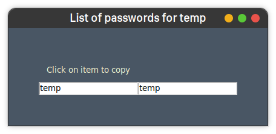
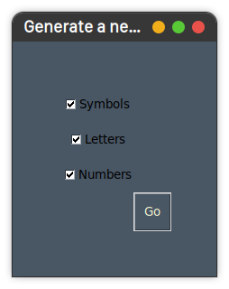

## Tkinter-based-gui with encrypted files:

The more good-looking desktop GUI password manager application based on tkinter. 
 
This is for someone who only wants to
use the app locally and/or not use any hidden/external databases for storage.
 
The data is stored in encrypted files!
 
It has all the basic features.

### Pre-requisites:

1. Follow [these](guides/basics.md) steps for initial **python and environment** setup.
2. Optional (but **recommended**): Set 2 environment variables on your system:
    - PY_PASS_MGR_USER: This will be the master username for the application.
    - PY_PASS_MGR_PASS: This will be the master password for the application.

### How to run:

1. Activate the venv you created, for this session:
    - Windows: `\path\to\venv\Scripts\activate.bat`
    - Unix or MacOS: `source /path/to/venv/bin/activate`
2. Now, inside the `/projects/pass-manager-tkinter-encrypted` directory of this repo, simply run the
   command: `python3 launcher.py`. Find this file [here!](../projects/pass-manager-tkinter-encrypted/launcher.py)

### How to use:

1. The app auto-detects the first-run so it will ask for a new master username and password if they aren't present
   already.
2. If username and password are found in the env then this will be skipped.

### Screenshots:

| Screen                  | Image                                                                                              |
|-------------------------|----------------------------------------------------------------------------------------------------|
| Login Screen            |                            |
| Main Application Screen |                   |
| Add a new password      |     |
| List saved passwords    |   |
| Generate a new password |  |
