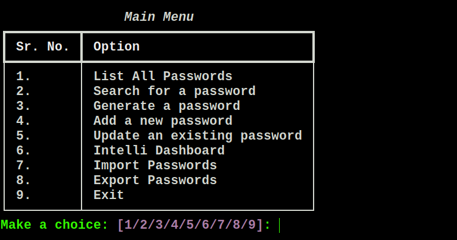

## Terminal-based-ui with mongodb:

The lightweight and fast implementation of the password manager. Based on mongodb, it allows the db to be present
anywhere (local or cloud).
 
It has all the basic features and MORE!

### Pre-requisites:

1. Follow [these](guides/basics.md) steps for initial **python and environment** setup.
2. Follow [these](guides/mongodb.md) steps for **mongodb** setup.
3. (Optional) Set the mongodb hostname and port in this [config](../projects/pass-manager-tui-mongo/data/config.ini)
   file.

### How to run:

1. Activate the venv you created, for this session:
    - Windows: `\path\to\venv\Scripts\activate.bat`
    - Unix or MacOS: `source /path/to/venv/bin/activate`
2. Now, inside the `/projects/pass-manager-tui-mongo` directory of this repo, simply run the
   command: `python3 launcher.py`. Find this file [here!](../projects/pass-manager-tui-mongo/launcher.py)

### How to use:

1. No user setup is seperately needed in mongodb, create user from within the application.
2. After user is created, all the features can then be used easily.

### Screenshots:

| Screen                  | Image                                                                                              |
|-------------------------|----------------------------------------------------------------------------------------------------|
| User Login              |                                |
| User Create             |                             |
| Main Menu               |                          |
| List saved passwords    |             |
| Generate a new password |                |
